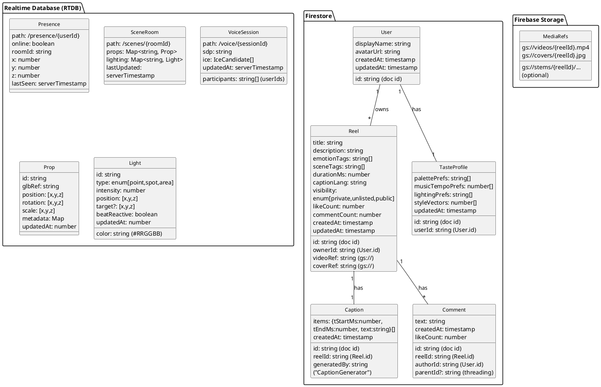

# ChronoMuse – Data Model (Firestore/RTDB) + Luxury Apartment UI Theme

## A) Data Model Diagram (Firestore & RTDB)
Paste the PlantUML below into your renderer to generate the schema diagram.



### Recommended Firestore Indexes
- `reels` composite: `ownerId ASC, createdAt DESC`
- `comments` composite: `reelId ASC, createdAt ASC`
- `reels` single-field: `visibility`, `emotionTags`, `sceneTags` (array-contains)

### Security Rule Outline (sketch)
- **Firestore**
  - `reels`: read if `visibility == public` or `request.auth.uid == ownerId`; write if `request.auth.uid == ownerId`.
  - `comments`: read if parent reel readable; create if `request.auth.uid != null`.
  - `users/{id}`: user can read/write own doc; public fields readable.
  - `users/{id}/taste/{tasteId}`: only owner read/write.
- **RTDB**
  - `/presence/{userId}`: user can write own node; everyone in room can read minimal fields.
  - `/scenes/{roomId}`: write if member of room; read if joined; rate limits on prop/light writes.
  - `/voice/{sessionId}`: participants only.

---

## B) Luxury Apartment UI Theme (Design Tokens & Layout)
Make the app feel like a **moody, high-end penthouse**: stone, brass, smoked glass, soft shadows, warm pools of light, with reactive glows to music/scene beats.

### Visual Direction
- **Style**: Modern noir penthouse · boutique hotel vibes · subtle art deco lines.
- **Materials**: dark walnut, nero marquina marble, brushed brass, smoked glass, velvet.
- **Lighting**: warm 2700–3000K accents; edge glow on focused elements; dim base.

### Core Tokens (Tailwind-like)
```json
{
  "color.bg": "#0C0D10",            // graphite night
  "color.surface": "#14161A",       // smoked slate
  "color.surfaceAlt": "#1A1D22",    
  "color.text": "#EDEFF2",
  "color.muted": "#A8AFBF",
  "color.brand": "#D4AF37",        // brass gold
  "color.accent": "#7BD1FF",       // cool neon edge
  "elevation.0": "none",
  "elevation.1": "0 2px 8px rgba(0,0,0,.35)",
  "elevation.2": "0 10px 30px rgba(0,0,0,.45)",
  "radius.card": "24px",
  "radius.control": "14px",
  "blur.glass": "8px",
  "glass.alpha": 0.12
}
```

### Components
- **Scene Card**: glassy surface (`backdrop-filter: blur(8px)`) with brass border (`1px` gradient), subtle inner shadow; reacts to beat with low‑freq glow.
- **Dials (Hydration/Sodium)**: concentric rings with marble texture insets; brand tick marks; haptic pulses on thresholds.
- **Crisis Calm Button**: large pill, brass rim, warm inner glow when armed; long‑press to trigger.
- **Editors (Scene/Lighting)**: split panes with smoked‑glass docks; draggable brass handles; sliders with luminous tracks.

### Layout & Motion
- **Grid**: 12‑col with generous gutters; cards have `radius.card` and `elevation.2`.
- **Motion**: slow bezier, micro‑parallax with cursor/gyroscope; camera‑like dolly in modal openings.
- **Beat Reactivity**: `BeatAnalyzer` exposes `--beat-strength`; use CSS var to modulate glow/scale.

### CSS Snippets
```css
:root {
  --bg:#0C0D10; --surface:#14161A; --text:#EDEFF2; --muted:#A8AFBF;
  --brand:#D4AF37; --accent:#7BD1FF; --glass:rgba(255,255,255,.12);
}
.app { background: radial-gradient(1200px 800px at 70% 0%, #111622 0%, var(--bg) 60%); }
.card { background: linear-gradient(180deg, rgba(255,255,255,.06), rgba(255,255,255,.02));
        backdrop-filter: blur(8px); border: 1px solid rgba(212,175,55,.25);
        box-shadow: 0 10px 30px rgba(0,0,0,.45); border-radius: 24px; }
.button-brass { background: linear-gradient(90deg,#9C7C23,#D4AF37 50%,#9C7C23);
        color:#0C0D10; border-radius:14px; }
[data-beat] { box-shadow: 0 0 calc(var(--beat-strength,0)*18px) rgba(123,209,255,.6); }
```

### React (Tailwind) Example – Luxury Dock
```tsx
export function LuxuryDock({children}){
  return (
    <div className="rounded-2xl p-4 md:p-6 bg-[rgba(255,255,255,0.06)] backdrop-blur-md border border-[rgba(212,175,55,0.25)] shadow-[0_10px_30px_rgba(0,0,0,0.45)]">
      {children}
    </div>
  );
}
```

### 3D Avatar & Decor Hooks
- Default avatar: load your model `/mnt/data/68e94e474099d80b93c9b714.glb` as a lobby centerpiece with soft rim light.
- Decorative props: low‑poly marble plinths, brass floor lamps; align with `LightingEditor` presets (Warm Lounge, Ice Blue Night).

---

## What to Confirm
1) **Apartment vibe**: Keep **Modern Noir Penthouse** or switch to **Warm Art‑Deco Luxe**?
2) **Firestore scope**: Do you also want `likes` as a subcollection under `reels/{id}` (for per‑user like lookup), or keep only `likeCount` on the reel doc?


## Addendum – KOL’s Hub Scope & Luxury Apartment Theme

**Scope alignment:** We will frame the MVP around KOL’s Hub (cross‑platform AI dashboard) while preserving the existing decisions (local‑first health, automation‑only E2EE sync).

**MVP Module Set (proposed)**
- Home Dashboard
- Body Weather (logs + trends)
- Meds & Vitals (BP, sodium, meds, reminders)
- Daily Routine Manager (pacing‑aware)
- Meal & Nourish Planner (printable, grocery hooks)
- Wardrobe & Outfits (sensory‑safe suggestions)
- Friendly Financial Advisor (basic budgets/bills + passive ideas seeds)
- AI Companion (Kol Twin) inline
- Automation Hub (cross‑device E2EE sync only)
- Dynamic Theme Manager + Accessibility/Low‑Spoon Mode

**Aesthetic:** Luxury apartment/penthouse (Modern Noir) — smoked glass, brass accents, warm 2700–3000K lighting. This applies across dashboards, editors, and reels.


## Method – Theme Variants & AI Theme Generator (Luxury Apartment Aesthetic)

### 1) Variant Catalog (shippable presets)
Each preset defines tokens for color, material, lighting, typography, motion. Initial set (expandable):
1. **Modern Noir Penthouse** – smoked glass, brass, walnut, warm pools of light.
2. **Dark Velvet** – velvet textures, silver emboss, plum/ink palette.
3. **Warm Art‑Deco Luxe** – champagne brass, geometric inlays, amber glow.
4. **Cyber‑Deco Nightclub** – chrome, neon cyan/magenta, mirror panels.
5. **Brutalist Monastery** – raw concrete, candlelight gold, serif display.
6. **Neo‑Baroque Salon** – carved ornament, wine red, antique gold accents.
7. **Witchy Cottage Noir** – charred wood, dried herb greens, candle flicker.
8. **Industrial Loft** – black steel, Edison amber, exposed brick.
9. **Sola‑Punk Conservatory** – moss green, copper, glasshouse highlights.
10. **Kintsugi Minimal** – ink black, porcelain white, gold seams.
11. **Desert Night Riad** – indigo night, terracotta, brass lanterns.
12. **Cathedral Techno** – stained‑glass gradients, organ‑beat glow.
13. **Vaporwave Boudoir** – mauve, teal, soft CRT bloom.
14. **Arctic Marble Gallery** – white marble, cool skylight, silver.
15. **Goth Regency Study** – oxblood leather, dark oak, candle haze.

> Source seeds: `/mnt/data/alt_goth_ui_themes_100.json` (100 theme ideas to seed the model).

### 2) Theme Token Schema (JSON, used across Web/iOS/Android/Desktop)
```json
{
  "id": "string",
  "name": "string",
  "palette": {"bg":"#0C0D10","surface":"#14161A","text":"#EDEFF2","muted":"#A8AFBF","brand":"#D4AF37","accent":"#7BD1FF"},
  "materials": {"wood":"walnut|oak|none","stone":"marquina|travertine|none","metal":"brass|chrome|iron"},
  "lighting": {"kelvin": 2900, "contrast": 0.85, "edgeGlow": 0.2},
  "radius": {"card":24, "control":14},
  "elevation": {"low":"0 2px 8px rgba(0,0,0,.35)", "high":"0 10px 30px rgba(0,0,0,.45)"},
  "textures": {"surface":"velvet|glass|concrete|marble|none"},
  "motion": {"easing":"cubic-bezier(.2,.8,.2,1)", "durationMs": 320},
  "beatReactivity": {"intensity":0.4, "bands":[60,120,240]},
  "typography": {"display":"Cinzel|Cormorant|Instrument Serif", "text":"Inter|Satoshi|SF Pro"}
}
```

### 3) AI Theme Generator (on‑device or serverless)
- **Inputs:** current preset tokens, user **TasteMemory**, optional prompt (e.g., “baroque cyberpunk winter”), ambient music/beat.
- **Outputs:** a new Theme JSON adhering to Theme Token Schema.
- **Seed data:** `/mnt/data/alt_goth_ui_themes_100.json` + user selections.
- **Algorithm:**
  1. Extract style vectors from seed JSON (color harmonies, material sets, light temp) → embed to vector space.
  2. Map TasteMemory to weights (e.g., prefers brass, warm light, plum). 
  3. Parse prompt → tag weights (e.g., “baroque” + “cyberpunk” + “winter”).
  4. Combine weights → candidate palettes via color harmony rules (triad/analogous; contrast targets).
  5. Validate accessibility (WCAG AA) → adjust contrast; fallback text color.
  6. Emit Theme JSON; preview on live components; user can save as **Custom Theme**.

### 4) PlantUML – Theme Generation Flow
```plantuml
@startuml ThemeGen
actor User
participant "TasteMemory" as TM
participant "Theme Seeds
(alt_goth_ui_themes_100.json)" as Seeds
participant "Theme Generator" as TG
participant "Preview Renderer" as PR

User -> TG: prompt ("baroque cyberpunk winter")
TM --> TG: taste weights
Seeds --> TG: seed vectors
TG -> TG: combine weights + harmony rules + WCAG adjust
TG --> PR: Theme JSON
PR --> User: live preview (accept/save?)
User -> TG: save as Custom Theme
@enduml
```

### 5) Implementation Notes
- Shared `@kol/theme` package exporting Theme type + CSS vars generator.
- React hook `useTheme()` applies tokens to Tailwind CSS variables.
- iOS/Android: map tokens to native styles; keep palette + radii consistent.
- Store customs in `users/{id}/taste/themes/{themeId}` (Firestore).
- Use music beat to modulate `--beat-strength` CSS var per current theme.
- Use `/mnt/data/68e94e474099d80b93c9b714.glb` avatar for lighting QA (rim‑light & shadow tests).

### 6) Example Generated Variants
- **Neo‑Baroque Winter Cyber‑Deco**: bg `#0B0D11`, brand brass `#D0B16E`, accent ice `#A5D8FF`, kelvin `3200`, texture `marble`, glow `0.25`.
- **Witchy Conservatory Night**: bg `#0E120F`, brand moss `#6FAF7A`, accent amethyst `#7C5C99`, kelvin `2800`, texture `wood`, glow `0.35`.

### 7) MVP Lock‑In (your decision)
- **MVP Presets to ship:** 6 presets — Modern Noir Penthouse, Dark Velvet, Warm Art‑Deco Luxe, Cyber‑Deco Nightclub, Brutalist Monastery, Neo‑Baroque Salon.
- **Generator Scope (MVP):** Users can **generate, save, and apply** custom themes. Export/share/marketplace deferred to V1.

