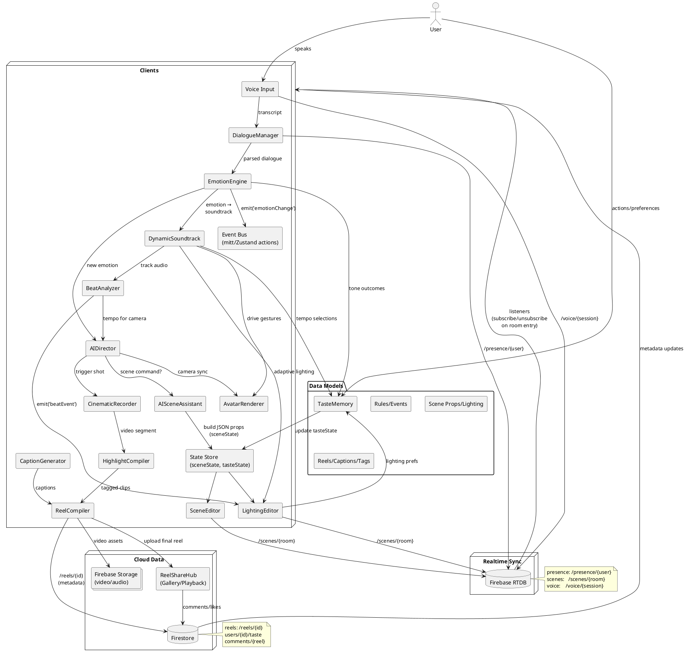

# ChronoMuse – Visual System Diagram

Below is a single **PlantUML** diagram capturing your end‑to‑end flow (voice → emotion → scene → soundtrack → reels) plus realtime sync and storage. You can paste this into any PlantUML renderer to generate the image.

