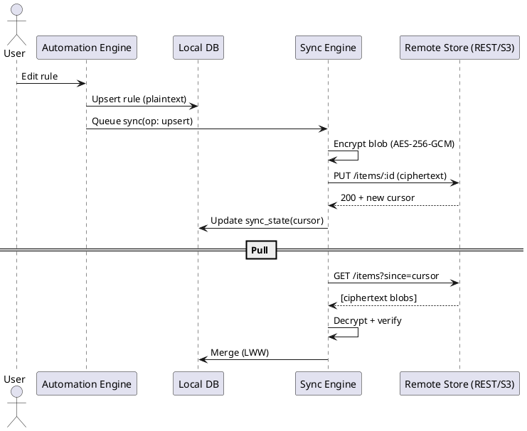

# SPEC-1-KOL Personal OS – MVP Architecture

## Background

KOL Personal OS is a cross‑platform, offline‑first personal operating system with a gothic‑futurist aesthetic and a strong focus on health/self‑advocacy, automation, and music. It currently runs on Web (PWA), Desktop (Electron), Android, and iOS via Capacitor with IndexedDB/Dexie for local storage and a service‑worker cache. A plugin system and automation engine already exist, and music is integrated (Spotify/YouTube/SoundCloud) with offline caching. WearOS/Pixel Watch 2 plugins deliver live vitals and activity, and the UI/theme system is extensible.

From the feature tracker/roadmap, the near‑term push (MVP → V1) emphasizes core health logs (hydration, sodium, pain/energy/mood “Body Weather”), emergency/crisis flows, and quick daily actions, while preserving privacy (local‑first) and offline capability across platforms.

Assumptions for this spec’s scope (to be confirmed):
- We will ship an MVP that includes: Hydration & Sodium logging/dials, Body Weather check‑in (pain/energy/mood + weather tag), Flare Tracker + Symptom Timeline (minimal), and Crisis Calm Mode with Freeze Protocol. Music/automation remain as‑is and are integrated where helpful (e.g., calm playlists triggers).
- **Sync scope (MVP):** Only Automation artifacts sync across devices (rules, triggers, actions, schedules, on/off state, and plugin settings). Health data remains local‑first with export/import only.
- Data stays local by default (IndexedDB/Dexie on Web/Electron; Capacitor Storage/SQLite on mobile). Cloud sync is **opt‑in** and limited to Automation artifacts.
- Tech stack: React + TypeScript + Vite, Capacitor (Android/iOS), Electron (Desktop), Dexie for IndexedDB, and minimal Node tooling for builds.

(Once scope and constraints are confirmed, the next sections will specify Requirements → Method → Implementation → Milestones → Gathering Results.)


## Requirements

**MoSCoW Prioritization (MVP)**

**Must‑Have**
- Local‑first health logging: Hydration (ml/oz) & Sodium (mg) dials/logs; Body Weather (pain/energy/mood + weather tag). Offline by default across Web (PWA), iOS/Android (Capacitor), and Desktop (Electron).
- Crisis Calm Mode incl. Freeze Protocol: one‑tap UI, configurable steps, optional music/automation triggers.
- Flare Tracker (minimal) + Symptom Timeline: quick entries, tags, and day view.
- **Automation Sync (only):** cross‑device sync of rules, triggers, actions, schedules, on/off state, and plugin settings. Opt‑in. **End‑to‑end encrypted** (server‑blind), zero‑knowledge.
- Export/Import: JSON (health + automation). No cloud for health in MVP.
- Plugin framework compatibility: existing plugins must keep working; versioned plugin manifest.
- Non‑functional: startup < 2s on mid‑range Android; log write < 50 ms; automation rule evaluation tick ≤ 100 ms; background CPU ≤ 3% avg while idle; initial app footprint ≤ 50 MB.
- Security/Privacy: encrypted at rest on device (OS‑level + IndexedDB/SQLite where available), E2EE for automation sync, no third‑party analytics; crash reports opt‑in, scrub PII.
- Accessibility: WCAG 2.1 AA for core flows; haptics + large‑type option.

**Should‑Have**
- Friendly rules editor (wizard + advanced JSON view) with validation and dry‑run.
- Basic conflict resolution for automation sync (last‑writer‑wins + per‑rule history up to N versions).
- WearOS/Pixel Watch plugin ingestion for vitals/activity (if present) feeding Body Weather context tags only (no cloud).
- Theming system parity across platforms; dark/goth default.

**Could‑Have**
- Routine templates (Morning Reset, Calm Now, Hydration Boost) as importable automation bundles.
- Calendar hooks (read‑only) to tag Body Weather entries by event/time block.
- Desktop CLI for quick log commands.

**Won’t‑Have (MVP)**
- Health data cloud sync, social sharing, or multi‑user features.
- Advanced analytics/dashboards beyond daily/weekly summaries.
- HIPAA/medical‑grade integrations.


## Method

### Automation Sync (Cross‑Platform, E2EE, Vendor‑neutral)

**Goal:** Sync only *automation artifacts* across Web (PWA), iOS/Android (Capacitor), and Desktop (Electron) with the same code, minimal vendor lock‑in, and no access to plaintext on servers.

**Artifacts to sync**
- `Rule` (id, name, enabled, trigger, conditions[], actions[], schedule, created_at, updated_at, version)
- `PluginSettings` (plugin_id, key→value)
- `Bundles` (named sets of rules/settings for import/export)
- Not synced: run logs, device bindings (e.g., media player endpoint), ephemeral caches.

**Crypto model (E2EE)**
- Key derivation: passphrase → PBKDF2‑HMAC‑SHA256 (≥ 310k iters), 256‑bit key, per‑user salt.
- Encryption: AES‑256‑GCM with random 96‑bit IV per item; ciphertext = {iv, tag, data}.
- Metadata server can see: item type, item id, size, updated_at, hash; never plaintext.
- Device keys: optional asymmetric device keypair to sign updates (prevents tampering/rollback).

**Sync topology**
- Client‑side *Sync Engine* (shared TypeScript) with adapters:
  - `HttpKVAdapter` (generic REST: `PUT /items/:id`, `GET /items?since=cursor`, `DELETE /items/:id`).
  - `S3Adapter` (any S3‑compatible store; objects at `automation/{user_id}/{item_id}.bin`).
  - `FilesystemAdapter` (Desktop local folder or USB key for fully offline relay).
- Cursor‑based delta sync; per‑item LWW resolution (`updated_at`, `version`). Retain last N versions per item (client‑side) for undo.

**Conflict resolution**
- Default: Last‑Writer‑Wins by `(version, updated_at)` with tie‑break on device_id.
- Optional per‑rule merge for array fields (`conditions`, `actions`) using 3‑way merge if both sides edited (MVP can defer; capture both as siblings).

**Client architecture**
- Monorepo packages: `@kol/automation-core` (schemas/types), `@kol/automation-engine` (eval runtime), `@kol/automation-sync` (E2EE + adapters), reused across Web/Capacitor/Electron.
- Storage: Dexie (Web/Electron) / Capacitor‑SQLite (mobile) with identical table shapes.

**Minimal server contract (portable)**
- Any host that can serve HTTPS + carry opaque blobs works: generic REST or S3‑compatible. No server code changes needed for crypto.
- Multi‑region optional via object storage; caching/CDN is safe because blobs are opaque.

**Schemas (TypeScript)**
```ts
type UUID = string;

export interface Rule {
  id: UUID;
  name: string;
  enabled: boolean;
  trigger: Trigger;              // event or schedule
  conditions: Condition[];       // all must pass
  actions: Action[];             // run in order
  schedule?: CronSpec;           // optional
  version: number;               // ++ on each local edit
  created_at: string;            // ISO
  updated_at: string;            // ISO
}

export interface PluginSettings {
  plugin_id: string;
  values: Record<string, unknown>;
  updated_at: string;
}
```

**Local DB tables**
- `rules`(id PK, json, version, updated_at)
- `plugin_settings`(plugin_id PK, json, updated_at)
- `outbox`(op_id PK, item_id, op: upsert|delete, ciphertext_blob, updated_at)
- `sync_state`(cursor, last_success_at)

**PlantUML – Sync Flow**



## Implementation

### 1) Cross‑Platform Targets (single codebase)
- **Shared packages** (pnpm workspaces):
  - `@kol/automation-core` — types, JSON schemas (zod), validators.
  - `@kol/automation-engine` — rule evaluation/runtime.
  - `@kol/automation-sync` — E2EE, outbox/inbox, adapters (REST, S3, Filesystem).
  - `@kol/ui` — shared React components (dials, check‑ins, crisis UI).
- **Apps**: `apps/web` (PWA), `apps/mobile` (Capacitor iOS/Android), `apps/desktop` (Electron + PWA shell).

### 2) Local Storage (identical shapes)
- **Web/Electron**: Dexie tables `rules`, `plugin_settings`, `outbox`, `sync_state`.
- **Mobile**: Capacitor‑SQLite schema:
```sql
CREATE TABLE IF NOT EXISTS rules (
  id TEXT PRIMARY KEY,
  json TEXT NOT NULL,
  version INTEGER NOT NULL,
  updated_at TEXT NOT NULL
);
CREATE TABLE IF NOT EXISTS plugin_settings (
  plugin_id TEXT PRIMARY KEY,
  json TEXT NOT NULL,
  updated_at TEXT NOT NULL
);
CREATE TABLE IF NOT EXISTS outbox (
  op_id TEXT PRIMARY KEY,
  item_id TEXT NOT NULL,
  op TEXT NOT NULL,
  blob BLOB NOT NULL,
  updated_at TEXT NOT NULL
);
CREATE TABLE IF NOT EXISTS sync_state (
  cursor TEXT,
  last_success_at TEXT
);
```

### 3) E2EE Key Management (client‑only)
- Passphrase → PBKDF2‑HMAC‑SHA256 (≥310k iters) → 32‑byte key; per‑user salt stored locally.
- Keys never leave device; derive on unlock; keep in memory; wipe on lock.
- Optional device keypair (Ed25519) for signing item manifests.

### 4) Portable Sync Adapters (no vendor lock‑in)
- **REST adapter** (default, runs anywhere):
  - `PUT /items/:id` body=ciphertext, headers: `If-Match` optional, returns `{cursor}`.
  - `GET /items?since=:cursor` → NDJSON of `{id, type, updated_at, blob}`.
  - `DELETE /items/:id`.
  - Can be hosted on any platform (Node, Deno, Bun, Python, PHP).
- **S3 adapter** (optional): any S3‑compatible object store.
- **Filesystem adapter** (Desktop): sync via a folder/USB for air‑gapped use.

### 5) Automation Rule Format (zod JSON Schema)
```ts
const RuleSchema = z.object({
  id: z.string().uuid(),
  name: z.string().min(1),
  enabled: z.boolean(),
  trigger: TriggerSchema,
  conditions: z.array(ConditionSchema),
  actions: z.array(ActionSchema),
  schedule: CronSpecSchema.optional(),
  version: z.number().int().nonnegative(),
  created_at: z.string(),
  updated_at: z.string(),
});
```

### 6) Build & Release
- Web: Vite PWA (service worker, offline cache, IndexedDB migrations).
- Mobile: Capacitor sync plugin wrapper + native SQLite; Android App Bundle + iOS archive.
- Desktop: Electron shell pointing to built PWA, file protocol for local import/export.

### 7) Minimal REST Reference Impl (any runtime)
- 200 lines reference server that persists opaque blobs to disk or a KV; no crypto.
- Config: `STORAGE_DIR`, `MAX_ITEM_MB`, CORS on.

### 8) Testing
- Unit: schema validation, crypto round‑trip, LWW merges, adapter mocks.
- E2E: two devices simulate conflicting edits; verify deterministic resolution.
- Perf: rule eval tick ≤100ms, sync 1k items <3s on mid bandwidth.

### 9) Migration/Safety
- Per‑item versioning; local snapshots for undo (last 10 versions).
- Recovery: if decryption fails → quarantine item; user prompt to re‑enter passphrase.

### 10) Accessibility & UX
- One‑tap Crisis Calm; large‑type option; haptics; color‑contrast checked.


## Milestones

1) **M0 – Foundation (1 week)**
- Monorepo setup (pnpm), shared packages `automation-core/engine/sync/ui` scaffold.
- Local DB layers (Dexie + Capacitor‑SQLite) with identical schemas.

2) **M1 – Automation Sync (2 weeks)**
- E2EE key derivation + AES‑GCM crypto utilities.
- Outbox/inbox + LWW merge; **REST adapter** reference server (portable runtime).
- Cross‑device sync happy path (create/edit/enable/disable rule; plugin settings).

3) **M2 – Health Core (2 weeks)**
- Hydration & Sodium dials/logs; Body Weather check‑in.
- Flare Tracker (minimal) + Symptom Timeline view.
- Export/Import JSON (all local data + automation bundles).

4) **M3 – Crisis Mode (1 week)**
- One‑tap Calm + Freeze Protocol (configurable steps, optional music triggers).
- Accessibility pass (large‑type, haptics, focus order, contrast).

5) **M4 – Cross‑Platform Polish (1 week)**
- PWA install + offline; Android/iOS builds via Capacitor; Electron desktop shell.
- Smoke tests across platforms; perf targets verified.

6) **M5 – Beta & Hardening (1 week)**
- Conflict tests, recovery flows, telemetry‑free crash reports (opt‑in).
- Docs: account‑less local mode, opt‑in sync, import/export.

## Gathering Results

- **Acceptance tests**:
  - Create/edit 20+ automation rules on Web; appear on Android/iOS/Desktop within a pull cycle.
  - Encrypt‑at‑rest verified: server stores only opaque blobs; decryption fails without passphrase.
  - Health logging offline for 7 days; no data loss; export/import round‑trip integrity.
  - Crisis Calm flows reachable in ≤2 taps; screen reader paths verified.
- **Performance**: rule eval tick ≤100ms; initial load <2s mid‑range Android; background CPU ≤3% idle.
- **Reliability**: conflicting edits resolved deterministically (LWW); quarantine on corrupt blob; undo from local snapshots.

